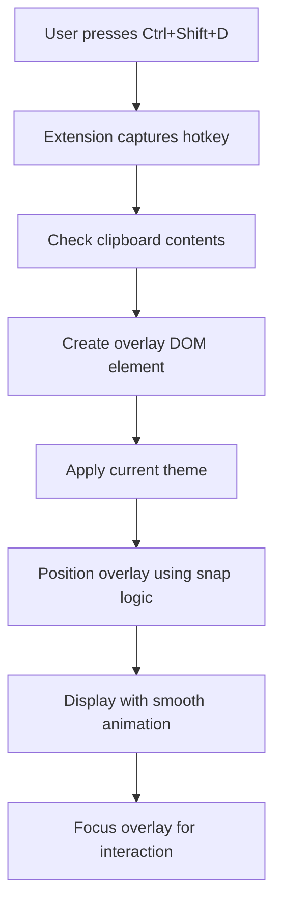
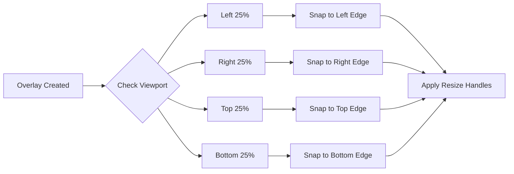

# chrome-clip - Smart Clipboard Overlay Extension

> A powerful Chrome extension that transforms your clipboard into an intelligent, themeable overlay for seamless data entry and form filling.

## 🎯 Project Overview

chrome-clip is a Chrome extension that displays clipboard contents in a sophisticated, resizable overlay triggered by customizable hotkeys. Designed for developers and power users who frequently need to reference or paste data while filling forms or working with web applications.

### Core Value Proposition
- **Instant Access**: Ctrl+Shift+D to instantly view clipboard contents
- **Smart Positioning**: Snap-to-edge sidebar (left/right/top/bottom at 25% viewport)
- **Persistent Display**: Stays open until explicitly dismissed
- **Theme Integration**: Beautiful vim-inspired themes (Gruvbox Dark, Catppuccin Latte, etc.)
- **Zero Friction**: No context switching between applications

## 🚀 Key Features

### Primary Features
- **Configurable Hotkeys**: Default Ctrl+Shift+D, fully customizable
- **Smart Overlay System**: Resizable, movable, snap-to-edge sidebar
- **Clipboard Integration**: Real-time clipboard content display
- **Theme Engine**: Multiple vim-inspired themes with easy switching
- **Persistent UI**: Overlay remains visible until manually dismissed
- **Cross-Page Persistence**: Survives navigation and page refreshes

### Advanced Features
- **Content Formatting**: Syntax highlighting for code, JSON, XML
- **Quick Actions**: Copy segments, format text, validate JSON
- **History Buffer**: Recent clipboard entries with timestamps
- **Form Integration**: Smart paste suggestions based on form context
- **Keyboard Navigation**: Full keyboard control for accessibility

## 🎨 Design Philosophy

### UI/UX Principles
- **Minimalist Interface**: Clean, distraction-free design
- **Contextual Awareness**: Adapts to webpage content and form fields
- **Vim-Inspired Aesthetics**: Familiar color schemes and typography
- **Smooth Animations**: Subtle transitions for professional feel

### Technical Architecture
- **Vanilla JavaScript**: No framework dependencies for maximum performance
- **Modular Design**: Clean separation of concerns
- **Event-Driven**: Efficient hotkey handling and DOM manipulation
- **Theme System**: CSS custom properties for dynamic theming

## 🛠️ Technical Implementation

### Extension Structure
```
clipsnap-extension/
├── manifest.json              # Extension configuration
├── background/
│   ├── service-worker.js     # Background script for hotkey handling
│   └── clipboard-monitor.js  # Clipboard change detection
├── content/
│   ├── overlay.js           # Main overlay logic
│   ├── themes.js            # Theme management
│   ├── positioning.js       # Snap-to-edge logic
│   └── keyboard-handler.js  # Hotkey processing
├── popup/
│   ├── popup.html          # Extension popup UI
│   ├── popup.js            # Settings and configuration
│   └── popup.css           # Popup styling
├── styles/
│   ├── overlay.css         # Core overlay styles
│   ├── themes/
│   │   ├── gruvbox-dark.css
│   │   ├── catppuccin-latte.css
│   │   ├── dracula.css
│   │   └── nord.css
│   └── animations.css      # Smooth transitions
├── assets/
│   ├── icons/              # Extension icons (16x16, 48x48, 128x128)
│   └── fonts/              # Custom fonts for themes
└── docs/
    ├── README.md
    └── API.md
```

### Core Technologies
- **Manifest V3**: Modern Chrome extension architecture
- **Chrome APIs**:
  - `chrome.commands` for hotkey registration
  - `chrome.storage` for settings persistence
  - `chrome.tabs` for cross-tab functionality
- **Web APIs**:
  - Clipboard API for content access
  - ResizeObserver for responsive behavior
  - MutationObserver for DOM changes

## 🎮 User Experience Flow

### Activation Flow


### Positioning System


## 🎨 Theme System

### Supported Themes
1. **Gruvbox Dark** (Default)
   - Background: `#282828`
   - Foreground: `#ebdbb2`
   - Accent: `#fabd2f`

2. **Catppuccin Latte**
   - Background: `#eff1f5`
   - Foreground: `#4c4f69`
   - Accent: `#1e66f5`

3. **Dracula**
   - Background: `#282a36`
   - Foreground: `#f8f8f2`
   - Accent: `#bd93f9`

4. **Nord**
   - Background: `#2e3440`
   - Foreground: `#d8dee9`
   - Accent: `#88c0d0`

### Theme Implementation
```css
/* CSS Custom Properties Pattern */
:root {
  --clipsnap-bg: var(--theme-bg);
  --clipsnap-fg: var(--theme-fg);
  --clipsnap-accent: var(--theme-accent);
  --clipsnap-border: var(--theme-border);
  --clipsnap-shadow: var(--theme-shadow);
}
```

## ⚙️ Configuration Options

### Hotkey Settings
- **Primary Hotkey**: Default `Ctrl+Shift+D`
- **Alternative Hotkeys**: Support for multiple combinations
- **Modifier Keys**: Ctrl, Shift, Alt, Meta combinations
- **Conflict Detection**: Warn about existing browser shortcuts

### Overlay Behavior
- **Default Position**: Left, Right, Top, or Bottom
- **Default Size**: 25% viewport with min/max constraints
- **Auto-dismiss**: Timer-based or manual only
- **Persistence**: Across page navigation and refreshes

### Theme Preferences
- **Theme Selection**: Dropdown with live preview
- **Custom Themes**: CSS import for personal themes
- **Font Settings**: Typography customization
- **Animation Speed**: Transition timing controls

### Integration Possibilities
- **Password Managers**: Enhanced security integration
- **Code Editors**: Syntax highlighting improvements
- **Productivity Tools**: Integration with task managers
- **API Connections**: External service integrations
